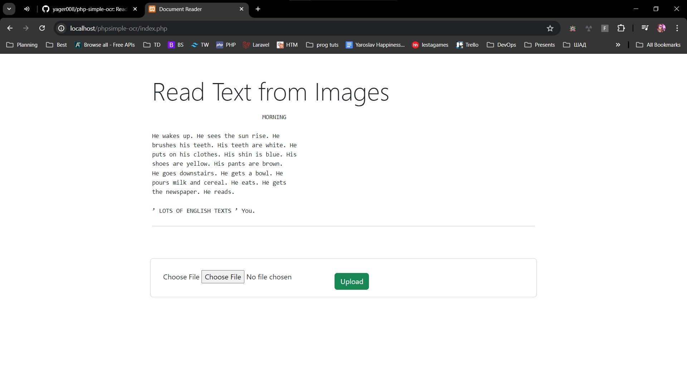

<<<<<<< HEAD
SETUP:
1. install xampp
2. start apache 
3. git clone repo to xampp htdocs folder
4. open index.php via browser

=======
## Read Images and Convert to Text using PHP
Pretty basic implementation and no effort has been put to achieve optimum results. I will consider this work in progress for now. you can view tutorial here https://www.youtube.com/watch?v=9dT_g4nBmvM&ab_channel=CodeWithBen
>>>>>>> 21fa5b1a8adaf2610a47cd78dae4e889db24acd9
